## 小组名称
  - caviar

## 小组成员


---

## 项目名称
  - 小红书笔记搜索引擎web应用开发

## 项目背景
  - 利用小红书针对关键词`杭州`的日志进行重新编排，提供搜索与推荐功能。


## 运行环境

```shell
# 软件
ubuntu 18.04
java 1.8
hadoop 2.9.2
hbase 1.4.9
kafka 2.11.0-1.0.0
spark 2.4.0
redis 5.0
```

```shell
# 开启hdfs
start-dfs.sh 
```

```shell
# 开启hbase
start-hbase.sh 

# 开启api支持
hbase-daemon.sh start thrift
```

```shell
# 开启kafka
bin/kafka-server-start.sh config/server.properties
```

```shell
# 使用spark

spark-submit --packages org.apache.spark:spark-streaming-kafka-0-10_2.11:2.1.0 ~/Desktop/user-process.py 
```


## 技术实现概览
  - 规范：大部分采用restful原则进行开发 
  - 爬虫：[简单的小红书爬虫](https://github.com/HhhuYu/xhs_simple_crawler) 
  - 后端：
    - SSM(用户数据存入mysql) 
    - Log4J(日志文件) 
    - redis(索引存储,相似文章推荐存储,拼音存储) 
    - hbase(小红书日志存储，用户画像存储) 
    - Kafka（请求队列) 
    - jieba (分词) 
    - hanlp (概要生成，拼音转换) 
    
  - 前端
    - jsp(大部分使用ajax) 
    - 使用js对页面进行动态渲染 
    - 界面设计 

  - 离线算法
    - 文章处理 
    - 索引建立 
    - 文章相似度 
    - 文章主题推断 
    - 根据用户收藏与点赞进行推荐 

  - 在线算法
    - 近义词同义词 
    - 用户交互处理   
    - 实时文章推荐  
    - 在线主题判断 


---

## 功能详细


- 功能模块概览
    - 管理员：
      - 控制用户的登录
      - 登录/注销
    - 游客：
      - 搜索历史
      - 普通搜索
    - 用户：
      - 收藏文章
      - 点赞文章
      - 生成用户画像
      - 登录与注销
      - 普通搜索
      - 基于用户画像的推荐

- 其他功能
	- 拼写检查
	- 摘要生成
	- 制定文章的相似文章推荐
	- 普通搜索
	- 广告推荐（待定）

- 详细模块介绍
  - 小红书爬虫
    - [github](https://github.com/HhhuYu/xhs_simple_crawler/edit/master/README.md)
  - word2vec模型
    - 使用中文维基百科的语料库训练成word2vec模型，进行近义词查询,找出关联度最高的一组词。
    - word2vec模型其实就是简单化的神经网络，它可以将所有的词向量化，这样词与词之间就可以定量的去度量他们之间的关系，挖掘词之间的联系。要想得到一个词的向量表达方法，需要训练神经网络语言模型，即CBOW和Skip-gram模型。这个模型的输出并不重要，我们关心的是模型中第一个隐含层中的参数权重，这个参数矩阵就是我们需要的词向量。最终我们需要的是训练出来的权重矩阵。首先下载最新中文wiki语料库，处理编码格式，采用了opencc繁体改为简体，去除一些非中文数据，接下来使用jieba对文本分词处理，处理完成后即可开始训练模型。
    - 测试模型效果
      - 女人-女孩+男孩＝男人
        - 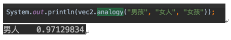
      - 国王－男人+女人＝女王
        - 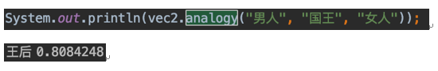
    - 查看查找的近义词的效果
      - 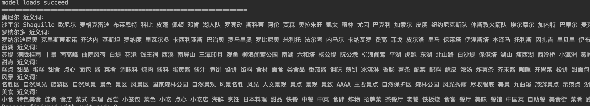
    - 参考文档：
      - [使用word2vec训练wiki中文语料](https://cloud.tencent.com/developer/article/1016786)
      - [Word2VEC_java](https://github.com/NLPchina/Word2VEC_java)

  - 翻译
    - 英文转中文 使用百度翻译api
  - 去重
    - 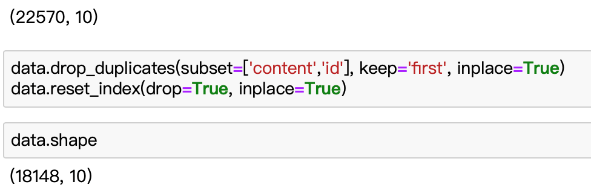
    - 按文章id和文章内容进行去重，删除了大概4000多条重复数据。

  - 数据处理分析
    - 从时间中提取到年、月、日、星期、小时等常见特征。分析评论
      - 各星期的各个小时评论数分布图
      - 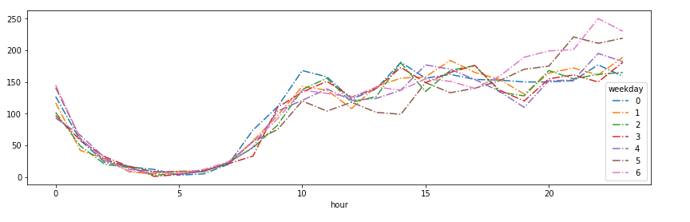
      - 可以看到用户多喜欢在晚上发布评论，星期五、星期六的晚上尤甚。
    - 然后定义一个受欢迎程度新属性，根据`favorite_count`、`comment_count`、`like_count`、`share_count`的和，在不同的区间内设置从0到5这5个程度。
      - 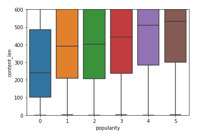
      - 评论的长短可以看出评论者的认真程度,字数越多的点评受欢迎程度越高。
    - Content 处理
      - 原文
        - 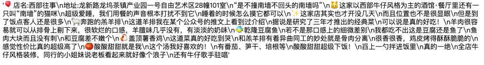
      - 除去非文本数据和无意义文本
        - 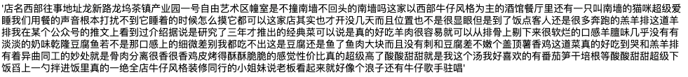
      - 使用pkuseg进行中文分词
        - 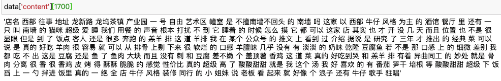
      - 使用jieba进行文章内容关键词提取
        - 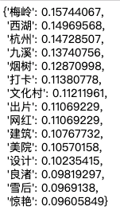
      - 转为json格式
        - 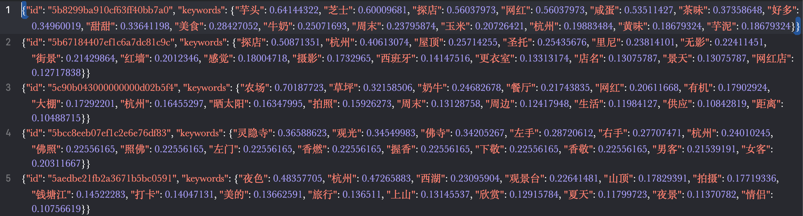
    - 对评论进行情感分析
      - 直接使用`chinese-word-vectors`知乎Word + Ngram的词向量。每一个词都对应一个长度为300的向量。进行简单的测试。效果不错。
        - 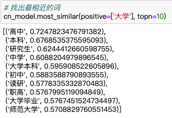
        - 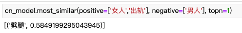
      - 下载预先分类过评论语料，训练样本分别被放置在两个文件夹里：pos，neg，每个文件夹里有2000个txt文件，每个文件内有一段评语，共有4000个训练样本。

      - 去掉每个样本的标点符号，然后用jieba分词，jieba分词返回一个生成器，没法直接进行tokenize，所以我们将分词结果转换成一个list，并将它索引化，这样每一例评价的文本变成一段索引数字，对应着预训练词向量模型中的词。

      - 因为每段评语的长度是不一样的，平均tokens的长度为71，最长的评价tokens的长度为1540，我们如果单纯取最长的一个评语，并把其他评填充成同样的长度，这样十分浪费计算资源，所以我们取一个折衷的长度。进过检验取tokens的长度为236时，大约95%的样本被涵盖。

      - 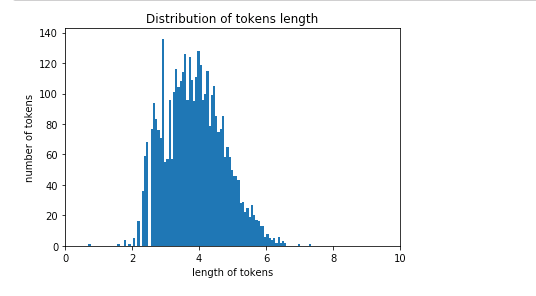

    - 为模型准备词向量矩阵
      - 根据参考资料的要求，我们需要准备一个维度为(我们使用的词汇的数量,300)的矩阵，每一个词汇都用一个长度为300的向量表示。
      - 90%的样本用来训练，剩余10%用来测试
    - 构建LSTM神经网络模型
      - 首先对测试样本进行预测，得到了还算满意的准确度。 之后我们定义一个预测函数，来预测输入的文本的极性，可见模型对于否定句和一些简单的逻辑结构都可以进行准确的判断。
        - 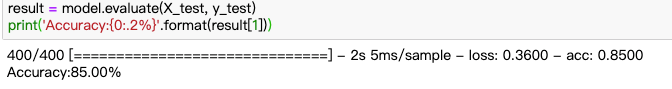
      - 测试
        - 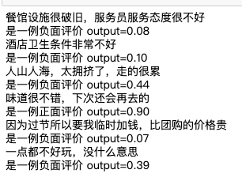
      - 经过查看，发现错误分类的文本的含义大多比较含糊，就算人去分也不容易判断极性。

  - 索引建立
    - 通过redis的有序集合sorted set实现。
    - 以一个索引项作为key，sorted set中是文章id和对应的索引项在文章中的评分。

  - 检索文章
    - 通过redis中的zunionstore与zinterstore，将部分索引项的文章做并集交集，获得的文章id和总评分放在一个临时的key中。

  - 拼写检查
    - 使用HanLP将中文转换为拼音
    - 以拼音的音码生成每个词源的拼音码
    - 通过redis中的sorted set存放26个字母为索引的拼音码以及对应的中文词语，方便检索相似读音的拼写。

  - 摘要生成
    - 使用HanLP文本推荐与自动摘要
      - 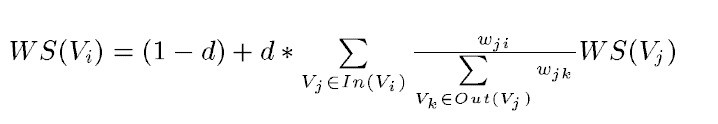
      - 等式左边表示一个句子的权重（WS是weight_sum的缩写），右侧的求和表示每个相邻句子对本句子的贡献程度。与提取关键字的时候不同，一般认为全部句子都是相邻的，不再提取窗口。
      - 求和的分母wji表示两个句子的相似程度，分母又是一个weight_sum，而WS(Vj)代表上次迭代j的权重。整个公式是一个迭代的过程。
      - 相似程度的计算使用BM25。BM25通常用来作搜索相关性平分。一句话概况其主要思想：对Query进行语素解析，生成语素qi；然后，对于每个搜索结果D，计算每个语素qi与D的相关性得分，最后，将qi相对于D的相关性得分进行加权求和，从而得到Query与D的相关性得分。


      - 不考虑关键词的提取文章摘要
        - 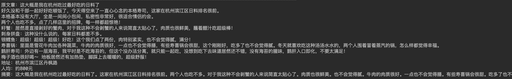
      - 考虑关键词的提取文章摘要
        - 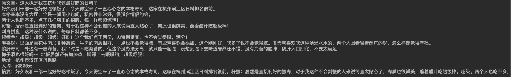

  - 数据库设计：
    - mysql  
      - tb_collection
        - 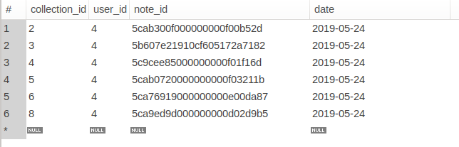
        - 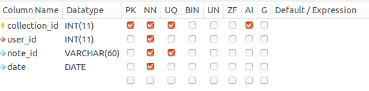
          ```
          | collection_id | user_id | note_id | date |
          | ------------- | ------- | ------- | ---- |
          | 收藏id        | 用户id  | 日志id  | 日期 |
          ```


      - tb_like
        - 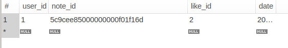
        - 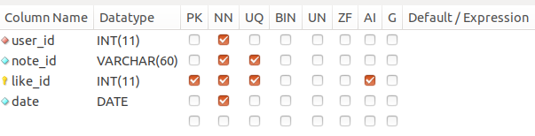
          ```
          | collection_id | user_id | note_id | date |
          | ------------- | ------- | ------- | ---- |
          | 点赞id        | 用户id  | 日志id  | 日期 |
          ```
      - tb_like
        - 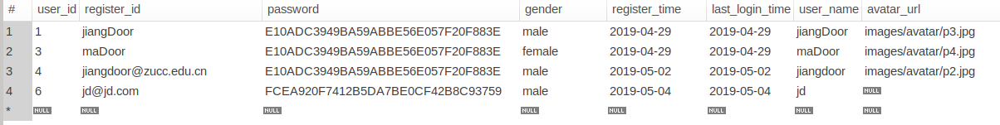
        - 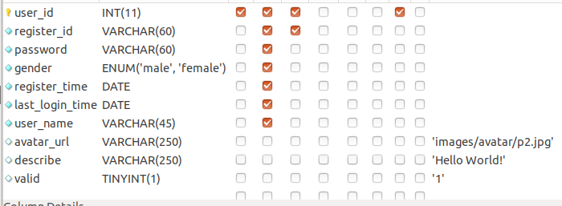

          ```
          | user_id | register_id | password     | gender | register_time |
          | ------- | ----------- | ------------ | ------ | ------------- |
          | 用户id  | 注册id      | 密码(加密过) | 性别   | 注册时间      |

          | last_login_time | user_name | avatar_rul | valid |
          | --------------- | --------- | ---------- | ----- |
          | 最后登录时间     | 用户名称   | 头像地址    | 有效性 |
          ```
  - 文章相似度分析
    - TF-IDF模型
      - TF-IDF是一种用于信息检索与数据挖掘的常用加权技术。TF意思是词频，IDF意思是逆文本频率指数
      - TFIDF的主要思想是：如果某个词或短语在一篇文章中出现的频率TF高，并且在其他文章中很少出现，则认为此词或者短语具有很好的类别区分能力，适合用来分类。  
    - TF-IDF模型训练
      - common_corpus语料库训练TF-IDF模型
      - 用训练好的'TF-IDF模型'  处理 "被检索文本" 和 "搜索词"
      - 将语料库作为被检索文本，用训练好的'TF-IDF模型'  处理 "搜索词"
      - 用json的形式存储文章与其他所有相似度较大的文章
  - 文章主题推荐
    - 主题推断LDA (Topic Model)
      - LDA文档主题生成模型，也称三层贝叶斯概率模型，包含词、主题和文档三层结构。
      - 利用文档中单词的共现关系来对单词按主题聚类，得到“文档-主题”和“主题-单词”2个概率分布。
    - gensim
      - 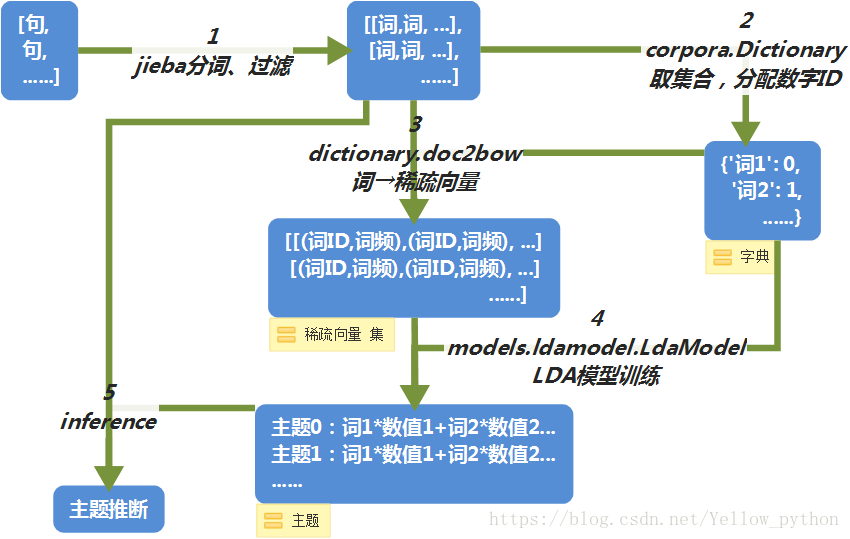
      - Gensim是一款开源的第三方Python工具包，用于从原始的非结构化的文本中，无监督地学习到文本隐层的主题向量表达 
      - 它支持包括TF-IDF，LSA，LDA，和word2vec在内的多种主题模型算法， 
      - 支持流式训练，并提供了诸如相似度计算，信息检索等一些常用任务的API接口
      - 镜像安装gensim：pip install gensim -i https://pypi.doubanio.com/simple
    - lda模型训练
      - 建立corpus语料库,供于模型训练
      - 考虑到我们爬取的文章类型有限，所以我们目前定义了10个主题
      - 输出每个主题中词的比重，即如果某文章出现某词就可能是该主题的比重
        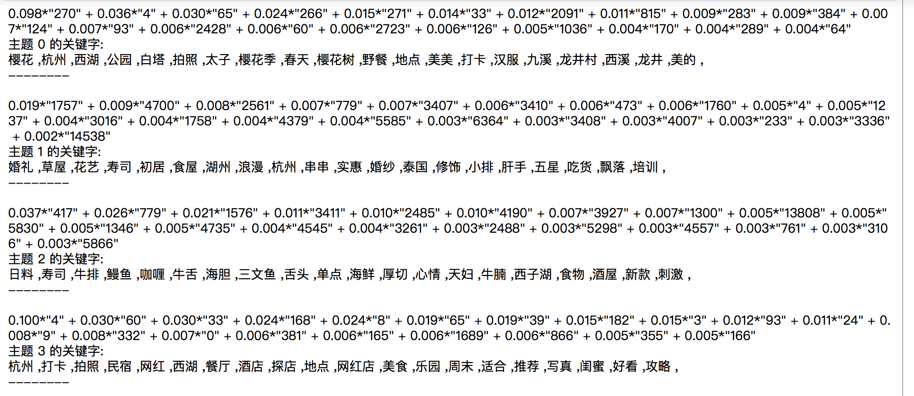
        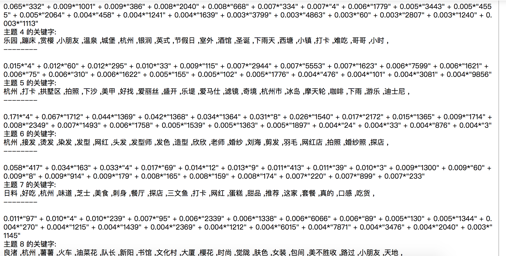
      - 基于语料库推断每一篇文章的主题 ```infer=lda.inference(common_corpus)```
      - 将判断好的主题以json的方式存储
    - 在线主题判断算法
      - 我们把训练好的LDA和dictionary存储起来,便于之后在线判断
      - 可以基于之前训练好的LDA模型判断文章主题
  - 推荐相关参考文献   
    - https://blog.csdn.net/Yellow_python/article/details/83097994
    - https://radimrehurek.com/gensim/models/ldamodel.html
    - https://blog.csdn.net/Yellow_python/article/details/81021142


  - 实时的根据用户画像进行推荐
    - 以kafka作为中间件，将客户端用户的交互点击搜索操作，反馈到后台spark部分。
    - 根据点击内容修改用户画像
      - 将点击文章通过之前离线算法获得的特征矩阵，对用户画像进行更改。
    
    - 更加搜索内容修改用户画像
      - 将搜索的内容更加LDA模型进行在线主题推断，获取特征矩阵，对用户画像进行更改。
    
    - 推荐内容的反馈
      - 以矩阵操作，获得与用户画像最匹配的6篇文章，加入到redis的list中，提供给客户端获取。
      - 通过余弦距离实现。

  - 离线的用户画像更新
    - 可以通过用户收藏的和点赞的文章对用户画像进行离线更新。
    - 使用LDA模型进行在线主题推断，获取特征矩阵，对用户画像进行更改。


